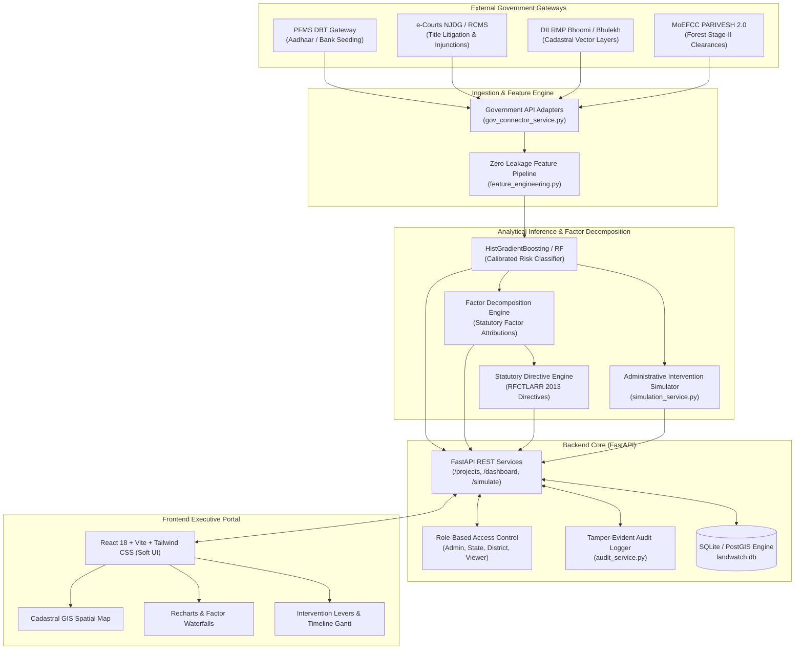

# LandWatch - System Architecture & Technical Specification

**Smart India Hackathon (SIH) 2026**  
**Problem Statement ID:** 26017  
**Platform Name:** LandWatch - Land Acquisition Monitoring & Decision Support System for Infrastructure Projects in India  

---

## 1. Executive Architecture Overview

**LandWatch** is an enterprise-grade geo-intelligence and predictive decision-support system designed to eliminate multi-year delays and cost overruns in Indian mega-infrastructure projects (PM GatiShakti National Master Plan). It ingests multi-source administrative telemetry (revenue court dockets, Bhoomi cadastral vector layers, PFMS payment logs, and MoEFCC PARIVESH clearances), applies calibrated analytical models to forecast milestone slippage, decomposes risk drivers using **Statutory Factor Attribution**, and provides an interactive **Administrative Intervention Simulator** to evaluate legal and administrative remedies.

---

## 2. Core Architectural Subsystems

### 2.1 Backend Core (FastAPI + SQLAlchemy)
- **High Concurrency & Async Engine:** Built on FastAPI with asynchronous I/O and strict Pydantic v2 data validation contracts.
- **Data Persistence:** Relational schema backed by SQLite for instant portable execution and PostgreSQL/PostGIS compatibility for enterprise spatial queries.
- **Role-Based Access Control (RBAC):**
  - `ADMIN`: National overview, full simulation capabilities, model calibration, and system configuration.
  - `STATE_OFFICER`: Scoped to projects and alerts within their designated state (e.g. Maharashtra).
  - `DISTRICT_COLLECTOR`: Scoped to projects within their district jurisdiction (e.g. Pune).
  - `VIEWER`: Read-only access for policy observers and academic evaluators.
- **Tamper-Evident Audit Logging:** Every simulation execution, notice resolution, or parameter adjustment records user identity, role, timestamp, client IP, and exact delta changes.

### 2.2 Statutory Factor Analysis & Attribution Engine
- **Factor Attributions:** Calculates exact marginal contributions for each administrative variable against national baseline risk (42%).
- **Waterfall Stepwise Decomposition:** Bridges predictive statistical models to executive understanding, demonstrating exactly how court dockets, DBT lags, or forest delays escalate project risk.

### 2.3 Administrative Intervention Simulator
- Operates in-memory without mutating the historical registry.
- Clones project baseline vectors, applies user-specified policy interventions (e.g., convening Lok Adalat sessions or expediting PFMS Aadhaar seeding), and recalculates risk probabilities and saved calendar days in < 50 milliseconds.

---

## 3. Statutory & Legal Alignment

The system directly models and maps interventions to statutory provisions of the **Right to Fair Compensation and Transparency in Land Acquisition, Rehabilitation and Resettlement (RFCTLARR) Act, 2013**:
- **Section 4:** Preliminary Survey & Identification of Land
- **Section 11:** Preliminary Notification and Social Impact Assessment (SIA)
- **Section 15 & 16:** Hearing of Objections and Resettlement & Rehabilitation (R&R) Scheme
- **Section 19:** Final Declaration of Acquisition (Lapsing risk if delayed > 12 months)
- **Section 23:** Enquiry and Land Acquisition Award by Collector
- **Section 38:** Power to take possession of land once compensation is disbursed
- **Section 64 & 76:** Land Acquisition, Rehabilitation and Resettlement Authority & Lok Adalat mediation references
